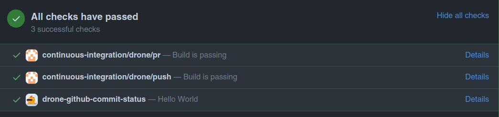

# Drone GitHub Commit Status

Send a custom commit status to a GitHub commit from Drone CI.



## GitHub setup requirements:

1. Create a github app
1. Get App ID (`github_app_id`)
1. Generate private key
1. Save private key as a Drone secret named 'github_app_private_key'
1. Install the GitHub App
1. Get the GitHub App installation ID (`github_installation_id`). This can be found from the URL: https://github.com/settings/installations/{github_installation_id}

## Drone config example:

```yaml
---
kind: pipeline
type: docker
name: push

platform:
  os: linux
  arch: amd64

steps:
  - name: commit-status
    image: robbymilo/drone-github-commit-status:latest
    settings:
      github_installation_id: {github_installation_id}
      github_app_id: {github_app_id}
      github_app_private_key:
        from_secret: github_app_private_key
      commit_context: drone-github-commit-status
      commit_state: success
      commit_description: Hello World
      commit_target_url: https://github.com/robbymilo/drone-github-commit-status
```
